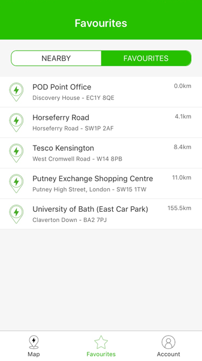

<p align="center">
    
</p>

# Pod Point - Front End coding test

Hi and welcome to our coding test for joining the Pod Point Software Team!

***

**Table of Contents**

* [Presentation](#presentation)
* [About your implementation](#about-your-implementation)
* [The task](#the-task)
  * [To do](#the-task--to-do)
  * [Bonus](#the-task--bonus) (optional)
* [About you](#about-you)
  * [Your comments](#your-comments) (optional)

***

<a id="presentation"></a>
## Presentation

This challenge is designed to test your HTML markup and CSS ability.

You should approach the task as you would any other piece of work in a typical day.
Think about the tools and libraries you might use to make your life easier. Think about your markup and CSS in terms of re-usability and maintainability across a larger scale product.

You should be able to produce the work with a high quality finish in an acceptable amount of time. We would expect this mini challenge to take at most a couple of hours.


<a id="about-your-implementation"></a>
## About your implementation

* Fill the [About you](#about-you) section below.
* If you have any notes to add to your test, please add them in the [Your comments](#your-comments) section below.
* Send a zip file with your completed entry to [peter.ward@pod-point.com](mailto:peter.ward@pod-point.com).

<a id="the-task"></a>
## The task

We’re keen to move the entire functionality of our Native App into a web application, mirroring the design layout, colour guide and iconography.

For this test you will need to implement this one page we need to move over (the favourites screen shown below), which details all the charging units a user has added to their favourites list.

<p align="center">
    <a href="./support/design.png">
        
        <br />
        View High Resolution
    </a>
</p>

In order to simulate the favourites data, you can call this API, which will return the 10 nearest units around our office:
https://api.openchargemap.io/v2/poi/?client=ocm.app.web.5.2.7_20151008&verbose=false&output=json&operator=3&latitude=51.52351420000001&longitude=-0.0917564&distance=10&distanceunit=KM&maxresults=10

You will want to look for the `AddressInfo` key in the payload which describes the location of the unit. You can also check the [sample data here](./support/sample-data.json)
> ***IMPORTANT: This file is only present for documentation purpose. Your implementation should not read data from this file but directly calling the API***

<a id="the-task--to-do"></a>
### To do

We’d like you to take this simple screen, and:
* Supply all of your source files.

* Using a mobile first approach, make it responsive.

* Markup the elements into an HTML structure, with associated stylesheet files.

* Make use of SASS/LESS (whichever is your favourite).
  * keep the scalability in mind when structuring your code, using your preferred CSS methodology.

* In the [Your comments](#your-comments) section below, feel free to add comments about
  * What changes should be done to the layout for bigger screens.
  * SASS code samples to illustrate your ideas.

* Prepare the following npm tasks:
  * `build`: Compile the CSS & JS inside a `dist` folder with a task runner (such as Gulp or Webpack).
  * `start`: Run the `build` task and starts a local web server.

* You don’t need to worry about any hamburger page menu.

* Clicking on the other buttons (`Nearby`, `Map` or `Account`) should only show a blank page with the corresponding title.

* Supply all of your source files.

<a id="the-task--bonus"></a>
### Bonus (optional)

* Add some unit and/or functional tests to your implementation.
* Make it a React JS application.

***

<p align="center">
    <strong>Thanks and good luck!</strong>
</p>

***

<a id="about-you"></a>
## About you

* **First name:** `Craig`
* **Last name:** `Robertson`


<a id="your-comments"></a>
### Your comments (optional)

As I have removed the node_modules file from the zip to decrease the size please
can you follow the step below:

### Installing and starting the app locally

1. Install the app package into the local Node.js runtime environment:

    ```bash
    yarn install or npm install
    ```

1. Start the app:

    ```bash
    yarn start or npm start
    ```
1. Point your browser to http://localhost:3000 to try out the app.
 
    
Running the tests:
    
        yarn test or npm test
   

### Comment 1

* I did a math rounding function for the distance as the data returned from the API is a large decimal. This math function rounded the number to two decimal places for it to be displayed as per the design.

### Comment 2

* For the favourites component I moved the fetch request up to the App component (Higher Order Component) and passed the data down as a prop.
This made it much easier to test as I wouldn't need to mock out the fetch method and allowed me to use Prop Types and default props which protects my code and drives good react practices.

### Comment 3

* I have made the CSS classes in the favourites component as generic as possible (item-list, item, etc.) so that they could potentially be used elsewhere. The NEARBY tab for example.

### Comment 4

* The footer component could be DRYed up and use some sort of map but as it was only 3 elements it should be okay and would probably cause more issues than it solved.
If I had more time I would wire in react-router to do these page transitions as the implementation logic I have used would not work once the project got larger.

### Comment 5

* I moved the switching page logic from the footer component again up to the higher order App component so that I could pass the page name down as a prop into the Header
component. Prop Types and default props where used again in the footer component again for this.

### Comment 6
* The header was a fairly simple component it took in a prop from the App component based on the page it was on, nothing really to see here.

### Comment 7

* The tabs component was set up similar to the footer I simply pass down the click function and what button is active. Once again this style of state management and page management is not scalable in the slightest and would fall over as the app grows, redux and react-router would help with this.

### Comment 8

* The App component contains all the logic for the app and feeds the other components via props. If I had more time I would have added some form of error and loading state
to the fetch function. This would give feedback to the user exactly what was going on. But yea other than that not much else to comment on.

* Note - At the time of writing this (29/09/2018) I was getting a 500 error returned from the endpoint provided. So it probably would have helped to implement the logic above. 

### Comment 9 - CSS

* For the CSS I used a fairly simple model, scss, used a global variable file for commonly use properties, nested properties to keep it cleaner and more readable. 
I should have used something like BEM but my BEM skills still requires work and is something I am looking at working on in the future. I am also not that keen on the
way I have done the sticky bottom footer giving it a fixed height and the page body having padding bottom to cater for this so the content does not overflow. This
is something I would look at fixing in the future.

* I have been heavily reliant on flex to make the app responsive this could cause some issues on older browsers. Thankfully though there are various npm libraries now that
can mitigate these issues thanks to polyfills. So it shouldn't be too much of a concern as my app uses these.

### Comment 10 - Testing

* All components I created have been fully unit tested and snapshot tested (the jury is still out whether I find snapshot testing effective or not). I have not really done much negative testing as these were fairly simple components but I am happy with the coverage. But I am hoping what I have provided is sufficient in the time that was recommended.
For some reason that I cannot explain some tests are complaining about a key prop. Although this key prop has been satisfied in my implementation in
the favourites component. Bit of a weird one to be honest.

### Comment 11 - Final Comment

* All in all, I thoroughly enjoyed this test and opencharge map API was easy and simple to work with.

Thanks


 
 
